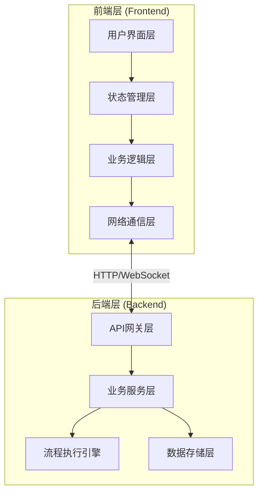
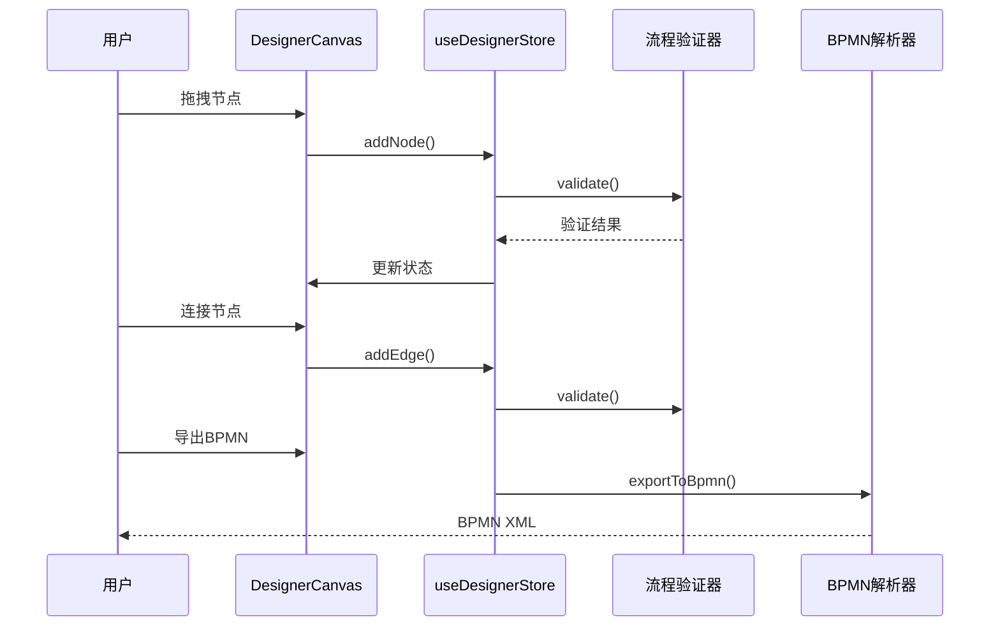
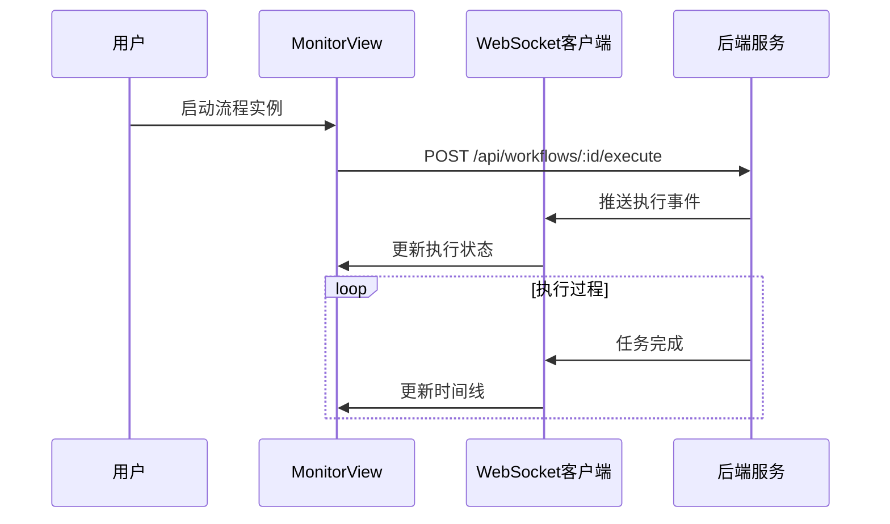
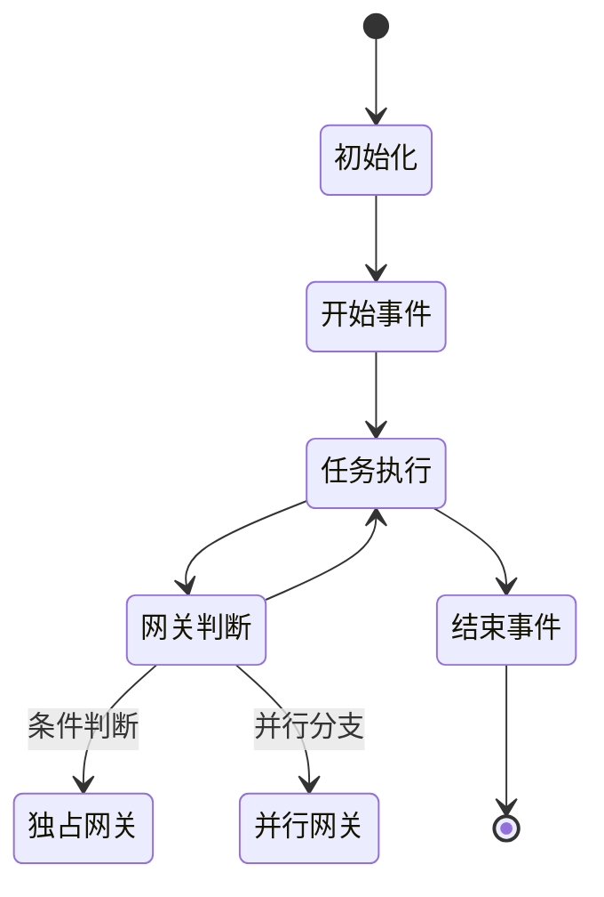
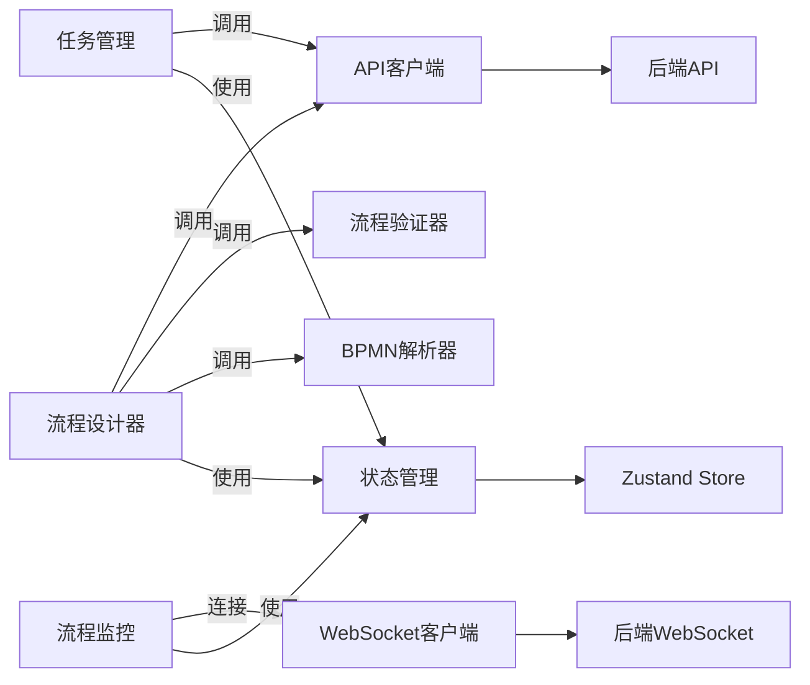
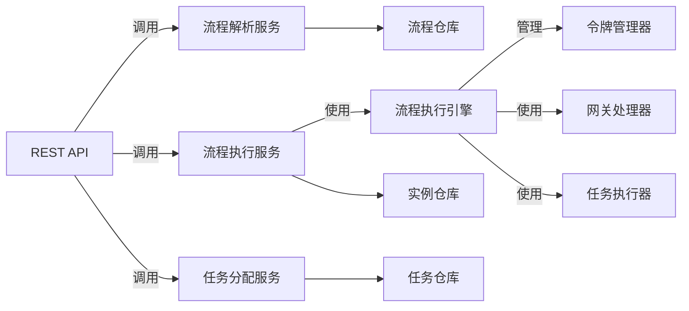
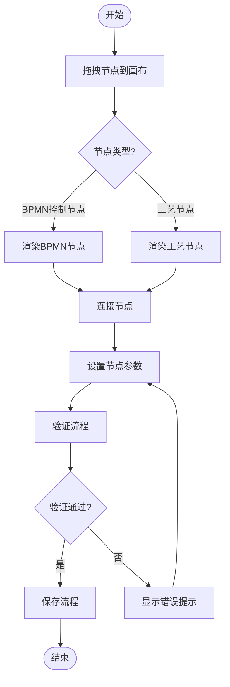
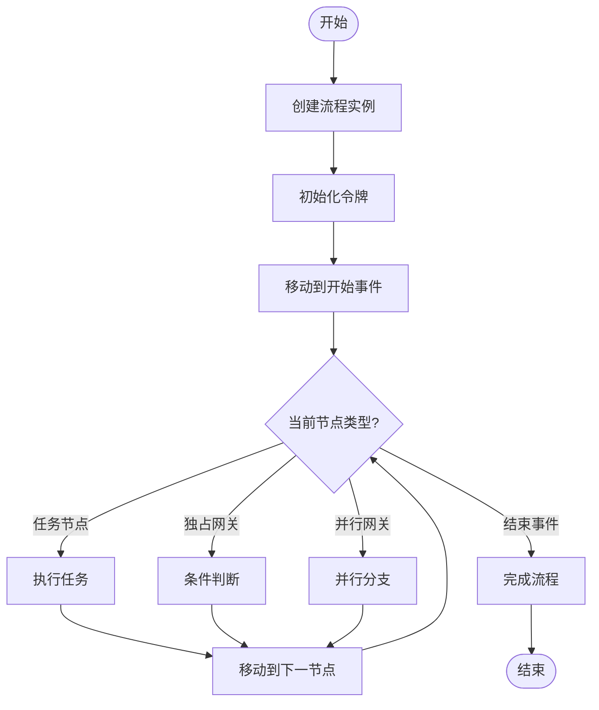
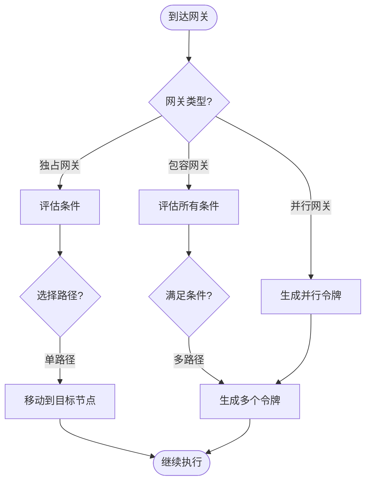

# BPMN工作流系统架构设计文档

**项目名称**: MES 饮料制造配方编辑器 - BPMN工作流
**版本**: 1.0.0
**创建日期**: 2026-03-22
**文档类型**: 系统架构设计

---

## 1. 架构概述

### 1.1 设计原则

- **全新设计**: 不考虑历史实现，从零开始设计
- **内存存储**: 采用内存数据存储，无需数据库持久化
- **端到端演示**: 确保完整的流程编排与执行效果可展示
- **前后端分离**: 清晰的前后端职责划分

### 1.2 技术栈选型

| 层级 | 技术选型 | 说明 |
|------|---------|------|
| **前端框架** | React 18 + TypeScript 5.2 | 现代化前端框架 |
| **流程图引擎** | React Flow 11.11 | 核心流程图渲染 |
| **状态管理** | Zustand 4.5 | 轻量级状态管理 |
| **拖拽库** | @dnd-kit/core | 增强拖拽体验 |
| **BPMN解析** | bpmn-moddle 8.x | BPMN 2.0 XML处理 |
| **UI组件** | Shadcn/UI + Tailwind CSS 3.4 | 现代化UI方案 |
| **后端框架** | Express + Node.js | API服务 |
| **通信协议** | HTTP + WebSocket | RESTful API + 实时通信 |
| **数据存储** | 内存存储 | 无需持久化，演示用 |

---

## 2. 系统分层架构

### 2.1 整体架构图



### 2.2 前端分层

#### 2.2.1 用户界面层 (UI Layer)

| 模块 | 职责 | 关键文件 |
|------|------|---------|
| 流程设计器 | BPMN流程可视化编辑器 | `src/bpmn-designer/` |
| 流程监控 | 流程执行可视化监控 | `src/bpmn-monitor/` |
| 任务管理 | 任务列表与管理界面 | `src/bpmn-tasks/` |

#### 2.2.2 状态管理层 (State Management Layer)

| 模块 | 职责 | 关键文件 |
|------|------|---------|
| 设计器状态 | 流程设计器状态管理 | `src/stores/useDesignerStore.ts` |
| 监控状态 | 流程执行监控状态 | `src/stores/useMonitorStore.ts` |
| 任务状态 | 任务管理状态 | `src/stores/useTaskStore.ts` |

#### 2.2.3 业务逻辑层 (Business Logic Layer)

| 模块 | 职责 | 关键文件 |
|------|------|---------|
| BPMN解析器 | BPMN XML解析与生成 | `src/services/bpmnParser.ts` |
| 流程验证器 | 流程正确性验证 | `src/services/workflowValidator.ts` |
| 撤销重做管理器 | 历史记录管理 | `src/services/undoRedoManager.ts` |

#### 2.2.4 网络通信层 (Network Layer)

| 模块 | 职责 | 关键文件 |
|------|------|---------|
| API客户端 | RESTful API封装 | `src/services/apiClient.ts` |
| WebSocket客户端 | 实时通信封装 | `src/services/wsClient.ts` |

### 2.3 后端分层

#### 2.3.1 API网关层 (API Gateway Layer)

| 模块 | 职责 | 关键文件 |
|------|------|---------|
| REST API | 流程CRUD接口 | `server/src/routes/workflow.ts` |
| WebSocket处理 | 实时事件处理 | `server/src/ws/workflowWs.ts` |

#### 2.3.2 业务服务层 (Business Service Layer)

| 模块 | 职责 | 关键文件 |
|------|------|---------|
| 流程解析服务 | BPMN流程解析 | `server/src/services/workflowParser.ts` |
| 流程执行服务 | 流程执行控制 | `server/src/services/workflowExecutor.ts` |
| 任务分配服务 | 任务分配与调度 | `server/src/services/taskScheduler.ts` |

#### 2.3.3 流程执行引擎 (Workflow Execution Engine)

| 模块 | 职责 | 关键文件 |
|------|------|---------|
| 令牌管理器 | 流程令牌(Token)管理 | `server/src/engine/TokenManager.ts` |
| 网关处理器 | 各类网关逻辑 | `server/src/engine/GatewayProcessor.ts` |
| 任务执行器 | 任务实例执行 | `server/src/engine/TaskExecutor.ts` |

#### 2.3.4 数据存储层 (Data Storage Layer)

| 模块 | 职责 | 关键文件 |
|------|------|---------|
| 流程仓库 | 流程定义存储 | `server/src/storage/workflowStore.ts` |
| 实例仓库 | 流程实例存储 | `server/src/storage/instanceStore.ts` |
| 任务仓库 | 任务实例存储 | `server/src/storage/taskStore.ts` |

---

## 3. 核心模块详细设计

### 3.1 流程设计器模块 (BPMN Designer)

#### 3.1.1 模块架构

```
src/bpmn-designer/
├── index.tsx                    # 模块入口
├── DesignerCanvas.tsx         # 主画布组件
├── DesignerToolbar.tsx        # 工具栏
├── DesignerContextMenu.tsx    # 右键菜单
├── nodes/
│   ├── NodeLibrary.tsx          # 节点库面板
│   ├── BpmnNodes/
│   │   ├── StartEventNode.tsx
│   │   ├── EndEventNode.tsx
│   │   ├── ExclusiveGatewayNode.tsx
│   │   ├── ParallelGatewayNode.tsx
│   │   ├── InclusiveGatewayNode.tsx
│   │   └── EventGatewayNode.tsx
│   └── ProcessNodes/
│       ├── DissolutionNode.tsx
│       ├── CompoundingNode.tsx
│       └── ... (15种工艺节点)
├── edges/
│   ├── SequenceEdge.tsx
│   └── ConditionalEdge.tsx
├── panels/
│   ├── PropertiesPanel.tsx
│   └── NodeLibraryPanel.tsx
└── hooks/
    ├── useBpmnParser.ts
    ├── useWorkflowValidation.ts
    └── useUndoRedo.ts
```

#### 3.1.2 核心功能流程图



### 3.2 流程监控模块 (BPMN Monitor)

#### 3.2.1 模块架构

```
src/bpmn-monitor/
├── index.tsx                    # 模块入口
├── MonitorView.tsx             # 监控主视图
├── ExecutionTimeline.tsx        # 执行时间线
├── InstanceList.tsx             # 实例列表
└── hooks/
    └── useExecutionMonitor.ts  # 执行监控Hook
```

#### 3.2.2 核心功能流程图



### 3.3 任务管理模块 (BPMN Tasks)

#### 3.3.1 模块架构

```
src/bpmn-tasks/
├── index.tsx                    # 模块入口
├── TaskList.tsx               # 任务列表
├── TaskDetail.tsx             # 任务详情
└── hooks/
    └── useTaskManager.ts       # 任务管理Hook
```

### 3.4 流程执行引擎 (Workflow Execution Engine)

#### 3.4.1 引擎架构

```
server/src/engine/
├── index.ts                    # 引擎入口
├── TokenManager.ts            # 令牌管理器
├── GatewayProcessor.ts          # 网关处理器
├── TaskExecutor.ts            # 任务执行器
└── types/
    └── engineTypes.ts          # 引擎类型定义
```

#### 3.4.2 执行流程



---

## 4. 核心数据结构定义

### 4.1 前端数据结构

```typescript
// 流程设计器状态
interface DesignerState {
  nodes: WorkflowNode[];
  edges: WorkflowEdge[];
  selectedNodeId: string | null;
  selectedEdgeId: string | null;
  history: HistoryItem[];
  historyIndex: number;
  validationErrors: ValidationError[];
}

// 流程监控状态
interface MonitorState {
  instances: WorkflowInstance[];
  selectedInstanceId: string | null;
  executionEvents: ExecutionEvent[];
  isConnected: boolean;
}

// 任务管理状态
interface TaskState {
  tasks: TaskInstance[];
  selectedTaskId: string | null;
  taskFilters: TaskFilters;
}
```

### 4.2 后端数据结构（内存存储）

```typescript
// 流程定义存储
interface WorkflowDefinition {
  id: string;
  name: string;
  bpmnXml: string;
  nodes: WorkflowNode[];
  edges: WorkflowEdge[];
  createdAt: Date;
  updatedAt: Date;
}

// 流程实例存储
interface WorkflowInstance {
  id: string;
  definitionId: string;
  status: 'RUNNING' | 'COMPLETED' | 'FAILED' | 'PAUSED';
  tokens: Token[];
  variables: Record<string, any>;
  startTime: Date;
  endTime?: Date;
}

// 任务实例存储
interface TaskInstance {
  id: string;
  instanceId: string;
  nodeId: string;
  status: 'PENDING' | 'IN_PROGRESS' | 'COMPLETED' | 'FAILED';
  assignee?: string;
  startTime?: Date;
  endTime?: Date;
  result?: any;
}

// 令牌(Token) - 流程执行令牌
interface Token {
  id: string;
  instanceId: string;
  currentNodeId: string;
  status: 'ACTIVE' | 'WAITING' | 'CONSUMED';
  createdAt: Date;
}
```

---

## 5. API接口定义

### 5.1 RESTful API

| 方法 | 路径 | 描述 |
|------|------|------|
| GET | `/api/workflows` | 获取流程定义列表 |
| POST | `/api/workflows` | 创建流程定义 |
| GET | `/api/workflows/:id` | 获取流程定义详情 |
| PUT | `/api/workflows/:id` | 更新流程定义 |
| DELETE | `/api/workflows/:id` | 删除流程定义 |
| POST | `/api/workflows/:id/execute` | 执行流程实例 |
| GET | `/api/instances` | 获取流程实例列表 |
| GET | `/api/instances/:id` | 获取流程实例详情 |
| GET | `/api/tasks` | 获取任务列表 |
| PUT | `/api/tasks/:id/complete` | 完成任务 |

### 5.2 WebSocket事件

| 事件名 | 方向 | 描述 |
|--------|------|
| `execution:started` | 服务端→客户端 | 流程实例已开始 |
| `execution:taskCompleted` | 服务端→客户端 | 任务已完成 |
| `execution:completed` | 服务端→客户端 | 流程实例已完成 |
| `execution:failed` | 服务端→客户端 | 流程实例失败 |

---

## 6. 模块关系图

### 6.1 前端模块关系



### 6.2 后端模块关系



---

## 7. 核心功能流程图

### 7.1 流程设计功能流程



### 7.2 流程执行功能流程



### 7.3 网关处理流程



---

## 8. 开发计划

### 阶段1: 基础设施搭建（Day 1-2）

- [ ] 创建项目目录结构
- [ ] 设置前端技术栈（React + TypeScript + React Flow）
- [ ] 设置后端技术栈（Express + Node.js）
- [ ] 实现基础API框架

### 阶段2: 流程设计器开发（Day 3-5）

- [ ] 实现流程画布基础功能
- [ ] 实现BPMN控制节点
- [ ] 实现15种工艺节点
- [ ] 实现节点连接系统
- [ ] 实现流程验证器

### 阶段3: 后端流程引擎开发（Day 6-8）

- [ ] 实现流程解析服务
- [ ] 实现流程执行引擎
- [ ] 实现令牌管理器
- [ ] 实现网关处理器
- [ ] 实现任务执行器

### 阶段4: 流程监控与任务管理（Day 9-10）

- [ ] 实现流程监控界面
- [ ] 实现任务管理界面
- [ ] 实现WebSocket实时通信
- [ ] 实现撤销重做功能

### 阶段5: 集成与测试（Day 11-12）

- [ ] 前后端集成
- [ ] 端到端流程演示
- [ ] 功能测试
- [ ] 测试报告生成

---

**文档版本历史:**

| 版本 | 日期 | 修改内容 | 作者 |
|------|------|----------|------|
| 1.0.0 | 2026-03-22 | 初始版本，全新架构设计 | AI Assistant |
