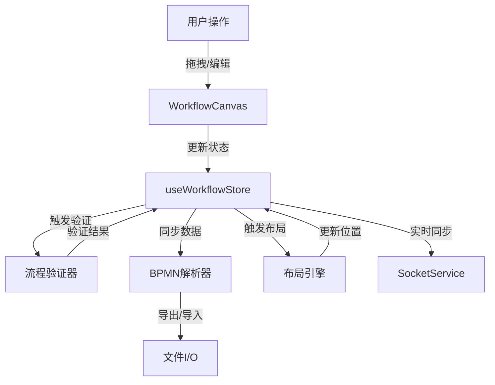

# MES饮料制造配方编辑器 - BPMN工作流可视化编排需求文档

**项目名称**: MES 饮料制造配方编辑器 (MES Recipe Editor)
**版本**: 2.0.0
**创建日期**: 2026-03-22
**文档类型**: 工作流可视化编排需求规范

---

## 1. 需求概述

### 1.1 项目背景

当前MES饮料制造配方编辑器已具备表格数据编辑与流程图生成联动功能，但用户主要通过数据填写方式生成工作流。为提升用户体验和工作效率，需要实现**直接可视化工艺路线绘制功能**，并兼容BPMN标准，支持复杂流程结构，同时优化交互体验。

### 1.2 核心目标

| 目标编号 | 目标描述 | 优先级 |
|---------|---------|--------|
| GOAL-001 | 实现可视化工艺路线直接绘制，替代现有数据填写生成方式 | Must Have |
| GOAL-002 | 确保系统符合BPMN 2.0标准，支持并行、串行、分支、合并、网关等核心元素 | Must Have |
| GOAL-003 | 优化交互体验，参考飞书多维表格工作流交互模式 | Should Have |

### 1.3 术语定义

| 术语 | 定义 |
|------|------|
| **BPMN** | Business Process Model and Notation，业务流程模型和符号标准 |
| **网关(Gateway)** | BPMN中的控制节点，用于控制流程分支和合并 |
| **独占网关(Exclusive Gateway)** | 根据条件选择一条路径执行 |
| **并行网关(Parallel Gateway)** | 同时启动多条路径或等待多条路径完成 |
| **包容网关(Inclusive Gateway)** | 选择一条或多条路径执行 |
| **事件网关(Event Gateway)** | 根据发生的事件选择路径 |
| **序列化流程** | 按顺序依次执行的任务序列 |
| **并行流程** | 同时进行的多个任务 |
| **工艺节点** | 代表具体生产工艺步骤的节点 |

---

## 2. 功能详细描述

### 2.1 可视化工艺路线编排功能

#### 2.1.1 流程画布

| 功能编号 | 功能描述 | 优先级 |
|---------|---------|--------|
| FR-001 | 提供无限滚动的流程画布，支持缩放和拖拽平移 | Must Have |
| FR-002 | 支持网格背景，提供视觉对齐参考 | Should Have |
| FR-003 | 提供画布坐标显示和缩放控制组件 | Should Have |
| FR-004 | 支持画布内容的全选、复制、粘贴操作 | Must Have |

#### 2.1.2 节点类型库

| 功能编号 | 功能描述 | 优先级 |
|---------|---------|--------|
| FR-010 | 提供BPMN标准节点库面板，包含所有工艺节点类型 | Must Have |
| FR-011 | 包含BPMN控制节点：开始事件、结束事件、各类网关 | Must Have |
| FR-012 | 包含现有15种工艺节点：溶解、调配、过滤、赶料、香精添加、萃取、离心、冷却、暂存、膜过滤、UHT杀菌、灌装、磁棒吸附、无菌罐、其他 | Must Have |
| FR-013 | 支持节点搜索和筛选功能 | Should Have |
| FR-014 | 节点库支持分类标签页展示 | Should Have |

#### 2.1.3 节点拖拽与放置

| 功能编号 | 功能描述 | 优先级 |
|---------|---------|--------|
| FR-020 | 支持从节点库拖拽节点到画布任意位置 | Must Have |
| FR-021 | 拖拽过程中显示放置预览和对齐辅助线 | Should Have |
| FR-022 | 放置节点时自动分配唯一ID | Must Have |
| FR-023 | 支持节点快速复制（按住Alt键拖动） | Should Have |

#### 2.1.4 节点连接

| 功能编号 | 功能描述 | 优先级 |
|---------|---------|--------|
| FR-030 | 支持从节点输出端口拖拽连线到另一节点输入端口 | Must Have |
| FR-031 | 连线过程中显示路径预览和智能吸附效果 | Should Have |
| FR-032 | 支持创建序列连线，标注投料顺序编号 | Must Have |
| FR-033 | 支持条件连线，可设置触发条件表达式 | Must Have |
| FR-034 | 自动检测并阻止循环依赖 | Must Have |

#### 2.1.5 节点选择与操作

| 功能编号 | 功能描述 | 优先级 |
|---------|---------|--------|
| FR-040 | 支持点击选择单个节点 | Must Have |
| FR-041 | 支持框选多个节点 | Must Have |
| FR-042 | 选择状态显示高亮边框和操作手柄 | Must Have |
| FR-043 | 支持节点拖动调整位置 | Must Have |
| FR-044 | 支持节点删除操作（Del键或右键菜单） | Must Have |

### 2.2 BPMN引擎兼容性

#### 2.2.1 BPMN核心元素支持

| 功能编号 | 功能描述 | 优先级 |
|---------|---------|--------|
| FR-100 | 支持BPMN 2.0标准开始事件（Start Event） | Must Have |
| FR-101 | 支持BPMN 2.0标准结束事件（End Event） | Must Have |
| FR-102 | 支持独占网关（Exclusive Gateway） - 条件分支选择 | Must Have |
| FR-103 | 支持并行网关（Parallel Gateway） - 并行分支/汇聚 | Must Have |
| FR-104 | 支持包容网关（Inclusive Gateway） - 多条件分支 | Should Have |
| FR-105 | 支持事件网关（Event Gateway） - 事件驱动分支 | Could Have |

#### 2.2.2 串行流程支持

| 功能编号 | 功能描述 | 优先级 |
|---------|---------|--------|
| FR-110 | 支持线性串行流程结构 | Must Have |
| FR-111 | 自动识别串行流程段并优化布局 | Must Have |
| FR-112 | 支持设置串行节点的执行顺序 | Must Have |

#### 2.2.3 并行流程支持

| 功能编号 | 功能描述 | 优先级 |
|---------|---------|--------|
| FR-120 | 支持多分支并行执行 | Must Have |
| FR-121 | 并行网关自动处理分支同步 | Must Have |
| FR-122 | 支持嵌套并行流程结构 | Should Have |
| FR-123 | 并行流程可视化区分（不同颜色或车道） | Should Have |

#### 2.2.4 BPMN数据导出/导入

| 功能编号 | 功能描述 | 优先级 |
|---------|---------|--------|
| FR-130 | 支持导出为标准BPMN 2.0 XML格式 | Must Have |
| FR-131 | 支持从BPMN 2.0 XML文件导入流程 | Must Have |
| FR-132 | 导入时验证BPMN文件有效性 | Must Have |
| FR-133 | 导出时保留所有自定义属性和参数 | Must Have |

### 2.3 交互体验优化

#### 2.3.1 飞书多维表格风格交互

| 功能编号 | 功能描述 | 优先级 |
|---------|---------|--------|
| FR-200 | 参考飞书多维表格工作流交互模式设计整体体验 | Should Have |
| FR-201 | 提供直观的工具栏，包含常用操作快捷按钮 | Must Have |
| FR-202 | 支持撤销/重做操作（Ctrl+Z / Ctrl+Y） | Must Have |
| FR-203 | 右键菜单提供常用操作选项 | Must Have |
| FR-204 | 快捷键提示和帮助面板 | Should Have |

#### 2.3.2 节点内联编辑

| 功能编号 | 功能描述 | 优先级 |
|---------|---------|--------|
| FR-210 | 支持双击节点直接进入编辑模式 | Must Have |
| FR-211 | 节点编辑支持内联表单，无需弹窗 | Should Have |
| FR-212 | 编辑时显示必填字段验证提示 | Must Have |
| FR-213 | 支持节点参数的快捷编辑界面 | Must Have |
| FR-214 | 节点编辑完成自动保存并更新状态 | Must Have |

#### 2.3.3 流畅的拖拽体验

| 功能编号 | 功能描述 | 优先级 |
|---------|---------|--------|
| FR-220 | 节点拖拽具有平滑的动画效果 | Should Have |
| FR-221 | 拖拽时智能吸附到网格或其他节点 | Should Have |
| FR-222 | 连线时自动计算最佳路径，避免交叉 | Must Have |
| FR-223 | 支持批量移动选中的多个节点 | Must Have |

#### 2.3.4 可视化反馈

| 功能编号 | 功能描述 | 优先级 |
|---------|---------|--------|
| FR-230 | 实时显示操作状态提示 | Must Have |
| FR-231 | 验证错误时高亮显示问题节点 | Must Have |
| FR-232 | 操作成功/失败的视觉反馈（toast提示） | Must Have |
| FR-233 | 加载状态的进度指示 | Should Have |

---

## 3. 用户界面设计规范

### 3.1 整体布局

```
┌─────────────────────────────────────────────────────────────────┐
│  顶部工具栏 (Toolbar)                                           │
├───────────────┬─────────────────────────────────────────────────┤
│               │                                                 │
│  节点库面板   │         主流程画布 (Canvas)                    │
│  (Node        │                                                 │
│   Library)    │                                                 │
│               │                                                 │
│               │                                                 │
├───────────────┼─────────────────────────────────────────────────┤
│  属性面板     │         状态栏 (Status Bar)                    │
│  (Properties  │                                                 │
│   Panel)      │                                                 │
└───────────────┴─────────────────────────────────────────────────┘
```

### 3.2 工具栏设计

| 区域 | 功能按钮 | 说明 |
|------|---------|------|
| 文件操作 | 新建、打开、保存、导出、导入 | 标准文件操作 |
| 编辑操作 | 撤销、重做、复制、粘贴、删除 | 编辑功能 |
| 视图操作 | 缩放、适应画布、网格开关 | 视图控制 |
| 验证 | 验证流程 | 流程正确性验证 |
| 协作 | 编辑锁、在线用户 | 协作功能 |

### 3.3 节点库面板设计

**布局要求：**
- 顶部：搜索框
- 中部：分类标签页（BPMN控制节点、工艺节点）
- 底部：节点列表，支持滚动

**节点卡片样式：**
- 显示节点图标和名称
- 悬停时显示简短描述
- 支持拖拽预览

### 3.4 主流程画布设计

**画布背景：**
- 浅灰色 (#F5F7FA)
- 可选网格线（间距 20px）
- 网格对齐吸附

**节点样式规范：**

| 节点类型 | 颜色规范 | 尺寸 |
|---------|---------|------|
| 开始事件 | 绿色 (#10B981) | 直径 40px |
| 结束事件 | 红色 (#EF4444) | 直径 40px |
| 独占网关 | 橙色 (#F59E0B) | 菱形 60x60 |
| 并行网关 | 紫色 (#8B5CF6) | 菱形 60x60 |
| 工艺节点 | 蓝色 (#3B82F6) | 矩形 160x100 |

**连线样式：**
- 实线：标准流程
- 虚线：条件连线
- 带箭头：流程方向

### 3.5 属性面板设计

**面板布局：**
- 节点基本信息（名称、类型、ID）
- 参数配置区域（动态表单）
- 验证提示区域

**交互要求：**
- 无选中节点时显示空状态
- 多选节点时显示公共属性
- 实时更新属性值

### 3.6 状态栏设计

**显示内容：**
- 左侧：缩放级别、画布坐标
- 中间：验证状态、节点/连线数量
- 右侧：协作状态、保存状态

---

## 4. 技术实现要求

### 4.1 技术栈要求

| 层级 | 技术选型 | 说明 |
|------|---------|------|
| 前端框架 | React 18 + TypeScript | 保持现有架构 |
| 流程图引擎 | React Flow 11.x | 升级到最新版本 |
| 拖拽库 | dnd-kit | 增强拖拽体验 |
| 状态管理 | Zustand 4.5 | 保持现有状态管理 |
| BPMN解析 | bpmn-moddle | BPMN 2.0 XML处理 |
| UI组件 | Shadcn/UI + Tailwind CSS | 保持现有UI方案 |

### 4.2 架构设计要求

#### 4.2.1 模块划分

```
src/components/workflow/
├── canvas/
│   ├── WorkflowCanvas.tsx          # 主画布组件
│   ├── CanvasToolbar.tsx            # 画布工具栏
│   └── CanvasContextMenu.tsx        # 右键菜单
├── nodes/
│   ├── NodeLibrary.tsx              # 节点库面板
│   ├── BpmnNodes/                   # BPMN标准节点
│   │   ├── StartEventNode.tsx
│   │   ├── EndEventNode.tsx
│   │   ├── ExclusiveGatewayNode.tsx
│   │   └── ParallelGatewayNode.tsx
│   └── ProcessNodes/                # 工艺节点
│       ├── DissolutionNode.tsx
│       ├── CompoundingNode.tsx
│       └── ...
├── edges/
│   ├── SequenceEdge.tsx              # 序列连线
│   └── ConditionalEdge.tsx           # 条件连线
├── panels/
│   ├── PropertiesPanel.tsx           # 属性面板
│   └── NodeLibraryPanel.tsx          # 节点库面板
└── hooks/
    ├── useBpmnParser.ts              # BPMN解析Hook
    ├── useWorkflowValidation.ts       # 流程验证Hook
    └── useUndoRedo.ts                 # 撤销重做Hook
```

#### 4.2.2 数据流架构



### 4.3 性能要求

| 指标 | 目标值 | 说明 |
|------|--------|------|
| 节点渲染 | <100ms | 单次渲染50个节点 |
| 连线渲染 | <50ms | 单次渲染100条连线 |
| 拖拽响应 | <16ms | 60fps流畅度 |
| 撤销/重做 | <50ms | 单次操作响应 |
| BPMN导出 | <1s | 50节点流程导出 |
| BPMN导入 | <1s | 50节点流程导入 |
| 流程验证 | <500ms | 完整流程验证 |

### 4.4 兼容性要求

#### 4.4.1 浏览器兼容性

| 浏览器 | 最低版本 |
|--------|---------|
| Chrome | 100+ |
| Firefox | 100+ |
| Safari | 15+ |
| Edge | 100+ |

#### 4.4.2 BPMN标准兼容性

- **兼容标准**: BPMN 2.0 (OMG BPMN 2.0.2)
- **支持元素子集**: 核心流程元素
- **不支持元素**: 泳池、泳道、消息流、协作等复杂元素

---

## 5. 数据结构定义

### 5.1 核心数据模型

#### 5.1.1 Workflow（工作流）

```typescript
interface Workflow {
  id: string;
  metadata: {
    name: string;
    version: string;
    description?: string;
    createdAt: string;
    updatedAt: string;
  };
  nodes: WorkflowNode[];
  edges: WorkflowEdge[];
}
```

#### 5.1.2 WorkflowNode（工作流节点）

```typescript
interface WorkflowNode {
  id: string;
  type: NodeType;
  position: { x: number; y: number };
  data: NodeData;
  style?: NodeStyle;
}

type NodeType = 
  | 'startEvent'
  | 'endEvent'
  | 'exclusiveGateway'
  | 'parallelGateway'
  | 'inclusiveGateway'
  | 'eventGateway'
  | ProcessType;

interface NodeData {
  name: string;
  description?: string;
  processType?: ProcessType;
  params?: Record<string, any>;
  conditions?: Condition[];
}

interface Condition {
  id: string;
  expression: string;
  label: string;
}
```

#### 5.1.3 WorkflowEdge（工作流连线）

```typescript
interface WorkflowEdge {
  id: string;
  source: string;
  target: string;
  type: EdgeType;
  data?: EdgeData;
  animated?: boolean;
  style?: EdgeStyle;
}

type EdgeType = 'sequence' | 'conditional';

interface EdgeData {
  sequenceOrder?: number;
  condition?: string;
  label?: string;
}
```

#### 5.1.4 ProcessType（工艺类型）

```typescript
enum ProcessType {
  DISSOLUTION = 'dissolution',
  COMPOUNDING = 'compounding',
  FILTRATION = 'filtration',
  TRANSFER = 'transfer',
  FLAVOR_ADDITION = 'flavorAddition',
  EXTRACTION = 'extraction',
  CENTRIFUGE = 'centrifuge',
  COOLING = 'cooling',
  HOLDING = 'holding',
  MEMBRANE_FILTRATION = 'membraneFiltration',
  UHT = 'uht',
  FILLING = 'filling',
  MAGNETIC_ABSORPTION = 'magneticAbsorption',
  ASEPTIC_TANK = 'asepticTank',
  OTHER = 'other'
}
```

### 5.2 BPMN XML映射

#### 5.2.1 节点映射

| 本项目节点类型 | BPMN 2.0元素 |
|--------------|--------------|
| startEvent | bpmn:StartEvent |
| endEvent | bpmn:EndEvent |
| exclusiveGateway | bpmn:ExclusiveGateway |
| parallelGateway | bpmn:ParallelGateway |
| inclusiveGateway | bpmn:InclusiveGateway |
| eventGateway | bpmn:EventGateway |
| 工艺节点 | bpmn:Task (带自定义属性) |

#### 5.2.2 自定义属性扩展

```xml
<bpmn:task id="P1" name="溶解">
  <bpmn:extensionElements>
    <mes:processType>dissolution</mes:processType>
    <mes:params>
      <mes:param name="temperature" value="80"/>
      <mes:param name="duration" value="30"/>
    </mes:params>
  </bpmn:extensionElements>
</bpmn:task>
```

---

## 6. 验收标准

### 6.1 功能验收标准

#### AC-001: 可视化编排基础功能

**EARS格式:**
```
WHEN 用户从节点库拖拽节点到画布，
THEN 系统应在指定位置创建节点并分配唯一ID。
```

**测试验证:**
- [ ] 单元测试：验证节点创建和ID分配
- [ ] 集成测试：验证拖拽到画布的完整流程
- [ ] E2E测试：模拟用户拖拽操作，验证结果

#### AC-002: BPMN元素支持

**EARS格式:**
```
WHEN 流程包含开始事件、结束事件、独占网关和并行网关，
THEN 系统应正确渲染所有元素并支持其功能。
```

**测试验证:**
- [ ] 渲染测试：验证所有BPMN元素正确显示
- [ ] 功能测试：验证网关分支逻辑
- [ ] 集成测试：验证复杂流程执行

#### AC-003: 节点内联编辑

**EARS格式:**
```
WHEN 用户双击节点进入编辑模式，
THEN 系统应显示内联编辑界面，
AND 允许用户直接在节点内填写和编辑内容。
```

**测试验证:**
- [ ] UI测试：验证双击触发编辑
- [ ] 交互测试：验证编辑功能
- [ ] 数据测试：验证编辑内容正确保存

#### AC-004: BPMN导入导出

**EARS格式:**
```
WHEN 用户导出流程为BPMN 2.0 XML，
AND 再重新导入该文件，
THEN 导入的流程应与原始流程完全一致。
```

**测试验证:**
- [ ] 导出测试：验证生成的XML符合BPMN标准
- [ ] 导入测试：验证从XML正确还原流程
- [ ] 一致性测试：验证导入导出的流程一致性

### 6.2 性能验收标准

| 指标 | 验收标准 | 测试方法 |
|------|---------|---------|
| 节点渲染 | 50个节点渲染 <100ms | 性能基准测试 |
| 拖拽响应 | 保持60fps | 帧率监控测试 |
| BPMN导入 | 50节点流程导入 <1s | 导入耗时测试 |
| 流程验证 | 完整流程验证 <500ms | 验证耗时测试 |

### 6.3 兼容性验收标准

- [ ] 在Chrome 100+上所有功能正常
- [ ] 在Firefox 100+上所有功能正常
- [ ] 在Safari 15+上所有功能正常
- [ ] 在Edge 100+上所有功能正常
- [ ] 导出的BPMN 2.0文件可被标准BPMN工具读取

### 6.4 用户体验验收标准

- [ ] 拖拽操作流畅无卡顿
- [ ] 交互反馈及时准确
- [ ] 新用户5分钟内可完成基础流程创建
- [ ] 符合飞书多维表格工作流的交互体验

---

## 7. 开发阶段规划

### 阶段1: 基础设施搭建（Week 1-2）

- [ ] 升级React Flow到最新版本
- [ ] 设计并实现新的数据结构
- [ ] 搭建工作流模块基础架构
- [ ] 实现基础画布功能

### 阶段2: BPMN核心元素实现（Week 3-4）

- [ ] 实现开始/结束事件节点
- [ ] 实现各类网关节点
- [ ] 实现节点连接系统
- [ ] 实现基本流程验证

### 阶段3: 工艺节点集成（Week 5-6）

- [ ] 集成现有15种工艺节点
- [ ] 实现节点内联编辑
- [ ] 实现属性面板
- [ ] 实现动态参数配置

### 阶段4: BPMN导入导出（Week 7）

- [ ] 集成bpmn-moddle库
- [ ] 实现BPMN导出功能
- [ ] 实现BPMN导入功能
- [ ] 实现自定义属性映射

### 阶段5: 交互体验优化（Week 8-9）

- [ ] 优化拖拽体验
- [ ] 实现撤销/重做
- [ ] 实现右键菜单
- [ ] 参考飞书风格优化UI

### 阶段6: 测试与验收（Week 10）

- [ ] 功能测试
- [ ] 性能测试
- [ ] 兼容性测试
- [ ] 用户体验测试
- [ ] 文档完善

---

## 8. 附录

### 8.1 参考资料

- [BPMN 2.0 Specification](https://www.omg.org/spec/BPMN/2.0.2/)
- [React Flow Documentation](https://reactflow.dev/)
- [bpmn-moddle](https://github.com/bpmn-io/bpmn-moddle)
- [飞书多维表格](https://www.feishu.cn/product/base)

### 8.2 相关文件

- 现有需求文档: `docs/REQUIREMENTS.md`
- 功能清单: `docs/FEATURES.md`
- 技术导航: `AI-GUIDE.md`
- 布局算法: `docs/AUTO_LAYOUT_ALGORITHM.md`

---

**文档版本历史:**

| 版本 | 日期 | 修改内容 | 作者 |
|------|------|----------|------|
| 2.0.0 | 2026-03-22 | 初始版本，基于BPMN工作流可视化编排新需求 | AI Assistant |
